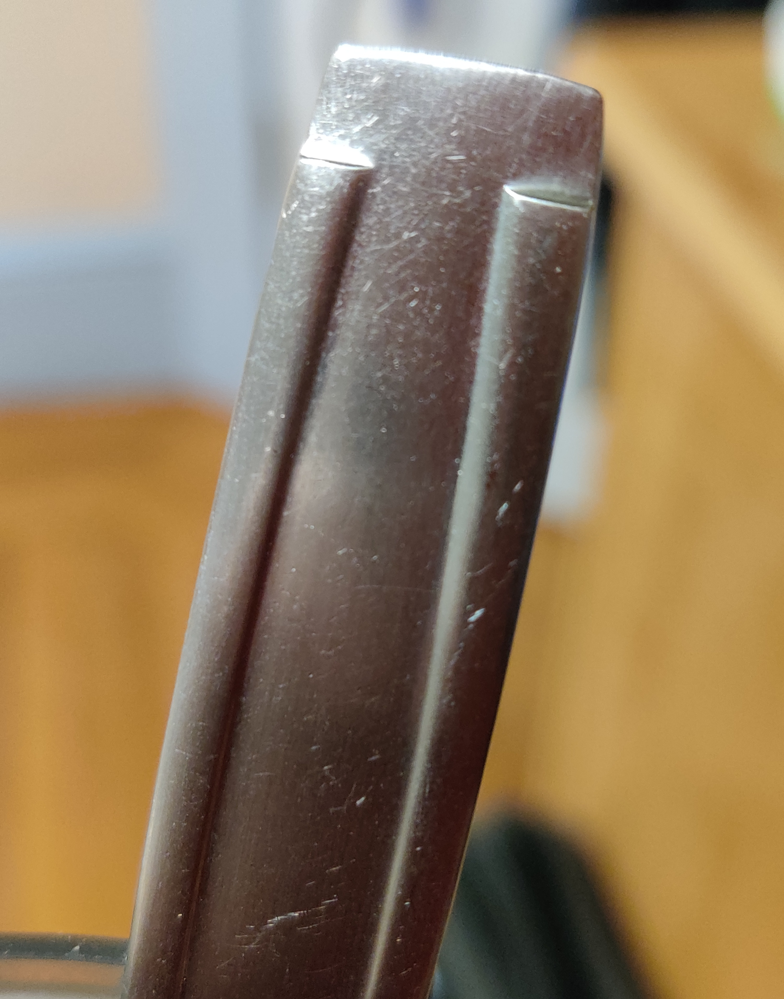
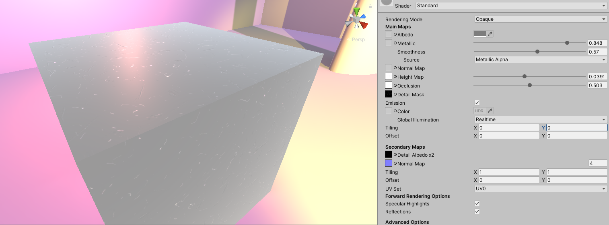
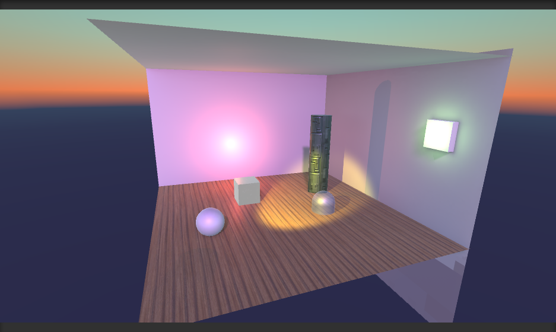
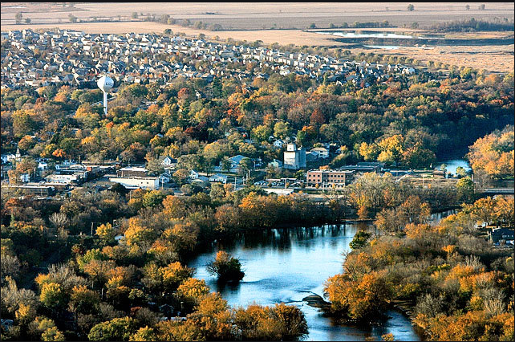
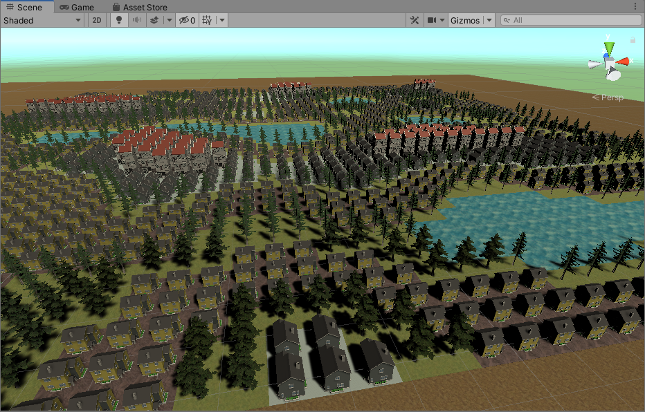

# CMPM163Labs

## Lab 2

Video Link:

https://drive.google.com/file/d/1SxzBG6bPWVESihB75JU0hfiXEgV9kGae/view?usp=sharing

Lab 2 Screenshot:

## Lab 3

Video Link:

https://drive.google.com/file/d/1UYIg0410YcUJ6Dx4wqpZWMg-Q2oBlz4F/view?usp=sharing

From left to right:

- The first cube is the Phong material shader with a green tint as guided from the lab.

- The second cube is a purple cube I made using Phong shader again, but as a wireframe with a light blue specular reflection. (The blue looks white in the video).

- The third cube is a red cube that I made using Three.js library Lambert shader and is partially transparent. I put a smaller cube inside it to show the transparency.

- The fourth cube is one that uses the interpolation as guided from the lab. I chose my own colors as directed.

- The fifth cube is one I made with my own shader by setting the RGB values of gl_FragColor to equal the respective XYZ position, my attempt to create the shader for the rainbow cube in the lab3 header.

- The sixth cube is one I also made with my own shader, by setting the RGB values of gl_FragColor to the positions of the same axis (X, in this case) at different offset intervals. It made a cool blue gradient that reminds me of the sky.

## Lab 4:

Video Link:

https://drive.google.com/file/d/1R45ctSKsWBahHzaDsTR51nBBLM0o9OaY/view?usp=sharing

Left to Right, Top to Bottom:

 - Cube 1: Followed Lab4 directions and loaded brick texture onto PhongMaterial cube using three.js texture functionality in html file.
 
 - Cube 2: A copy of the first cube, additionally with a matching Normal Map also using three.js texture functionality in html file.
 
 - Cube 3: An custom cube using the same method as Cube 2, except this time, I used mismatching texture and normal map. I used texture 156 and normal map 172 from the provided assets.
 
 - Cube 4: Followed Lab4 directions and loaded a texture onto a cube via shaders instead of three.js's functionality. It uses ShaderMaterial insted of PhongMaterial so the light doesn't affect it.
 
 -Cube 5: I tiled a texture into a 2x2 grid with my own fragment shader. I did this by scaling the texture into position for each tile and set it as its own vec4. This gave me 4 vec4s (top left, top right, bottom left, and bottom right tiles). I used if statements to check for the correct uv coordinate conditions and elected the corresponding vec4 tile that should be projected on that quadrant to set gl_FragColor to equal to. 

Answers to 24:

a) x = ⌊ u * 8 ⌋  or  x = Math.floor(u * 8);

b) y = ⌊ (v * -8) + 8 ⌋  or  y = Math.floor((v * -8) + 8);

c) The color sampled is white.

## Lab 5: Part 1

Video Link:

https://drive.google.com/file/d/1ovIaOF6RQhILVuuVFUTzu9skBc7lIrQ7/view?usp=sharing

My first modification is the required sparking particle affect coming out from the kart's wheels. I made this by following the tutorial: creating a particle system, changing it's properties (size, speed, angle, color: blue instead of tutorial's purple, etc.) in the inspector to make the particles look how I wanted. I also added a second particle system that doesn't move but acts as the "source" from where the first particle system emits, which was also in the tutorial. I then duplicated these systems to attach to the other back wheel for symmetry.

My next modification was adding a custom trigger at the finish line that has confetti bursting out when the kart passes it. I did this by creating a rectangular prism (scaled cube) over the finish line and set it as a trigger, adding the simple trigger component, and setting the provided confetti particle prefab I put in the scene to play when the trigger is activated.

Another modification was giving the player character model a top hat, and changed the color from black to white-ish-blue by changing the material's albedo color.

Another modification I made was change the skybox. I did this by downloading and importing a free skybox asset from the Unity Asset store (because I don't have appropriate images to create my own skybox material) and switching out the kart tutorial's skybox material for the new one in the lighting settings. 

The last modification I made was add a billboard model (from the kart tutorial's mod assets) to the scene. I replaced the plain color of the billboard content material with an image of Seth Everman's profile picture.

## Lab 6: Part 1

Spotlight: This light shines in one direction and is affected by both position and rotation.

Directional Light: This light shines in one direction and acts like a sun. It affects all objects in the scene, no matter the light's position. The light's direction can be changed by rotating it.

Point Light: This light shines in all directions, so it is unaffected by rotation. It's position can be changed.

Area Light: This light only works when baked into a lightmap. It emits light from one side of a plane.

Materials & Standard Shader:

 

I made a material to resemble the scuffed and scratched metal of a fork handle. I made this by finding a texture of scratches online and applied the normal, height, and occlusion maps that came with it. However, The texture's background was too dark so changing the albedo color couldn't lighten the abse color to the gray I needed. Instead, I applied the texture as the material's secondary map and turned on emission to have the texture's details show and also be able to change the base color to gray. I then editted the material's metallic and smoothness properties until I could get the dull looking diffused reflection like the original object.

Textures:

I added a wood texture for a wood-panelled floor in my scene, including normal, occlusion, and metal maps. I tiled the texture so it would lok more like an actual floor's panelling.

I found a texture of sci-fi themed metal panels and implemented them into a material with its normal, occlusion, and metal maps and applied to an oblong cylinder pillar object. I tinted the base a blue-ish green color and doubled the normal map value so the texture would stand out more.

Skybox:

I made a procedural skybox, chose a dark blue for the ground and a pale teal for the sky. I messed around with the atmosphere thickness and exposure to get a cool burning red in between the sky and ground.

## Lab7: Part 1

Video Link:

https://drive.google.com/file/d/1fdc81Ibw8A9hMBWuumwGEBk2BOG1lue0/view?usp=sharing

After following the tutorials, I made my scene by setting up a rough looking platform with a shader similar to the first tutorial. I set it's color to fade from brown to green and back over time. I made trees by having spheres modified by pbr shaders the same way as in the tutorial but using a different noise texture and set them on top of cylinders. I gave the cylinders texture and normal maps of tree bark for trunks. I gave the tree tops a 2d leaf texture through the shader graph and made it a brighter green. I made rocks in a similar method as above, but with different values in amount of noise, offset, and multiplies. I gave it a 2d texture of a rock's surface. I applied this rock shader to spheres and capsules and set these objects up around the water wave plane made in the tutorial. With another plane through the pbr shader graph, I made a mountain range by remapping noise on the Y axis and texturing the plane with another rocky texture. I placed it over a flat rocky area to make a cove at the edge of the water and put a red pointlight there. I also added a large spotlight above the whole scene and pointed it diagonally across the scene to have variety in lighting. I put in a particle system in a hemisphere shape above the rest of the scene and let it slowly rain blue and yellow particles. Lastly, I switched out the skybox so the background was something other than gray.

Checking in with partner:

i. Part1

ii. They found the wave tutorial challenging.

iii.The shader graph was most interesting to them.

My partner and I worked on our labs separately.

## Lab8: Part 1

Inspiration city: Oswega, Illinois

My generated city:

The inspiration city affected my generated city by influencing my choice of assets I used. I chose suburban type houses. I also didn't stick to buildings and used trees as well because the inspiration city has quite a bit of foliage in between buildings, which I tried to imitate. I also added water to be proceduraly generated because my reference image seems to have spots of water.

Checking in with partner:

For the creative portion, my partner picked up a few more different buildings from the asset store for more variety in buildings in their city. Some of the buildings are extremely different in size, and because of how large some of them are, they clip through each other. Because the large buildings are clustered together, the clipping gives an interesting look to the city. I didn't learn anything new when shown my partner's work.
